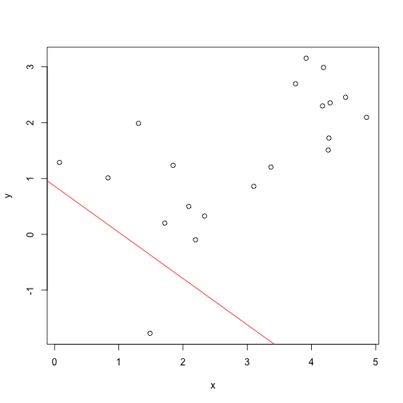

## What does this Shiny Application do?

The object of this project is to help visualize the line of regression which
is obtained by the least squares method. The user is presented with a plot of data points and using two sliders the user can adjust the position of the line
relative to the data. The line is updated immediately on the graph as they vary the parameters of the line, namely the slope and the intercept. The user is interactively shown the sum of the squares of the distances bewteen the data points and the line that they are choosing to help them choose the line.

Once they have chosen the line they can press a button which will draw the regression line on the same plot, and show them the values of the slope and intercept parameters calculated by the lm command in R. They are also shown the least possible value of the sum of squares of the distances acheived by the lm algorithm.

An added bonus of this visualization is for the user to observe how changing the slope and the $y$-intercept affects the line. For students not very familiar with equations of straight lines this can be a useful tool.


---

## The R code

The app starts by generating a set of data points as follows:

```r
k=20
x=runif(k, 0,5)
slope <- runif(1, -1,1)
slope=round(slope,digits=2)
y=slope*x+rnorm(k,0,1)
```

This generates a set of 20 data points where the correlation (or the slope) between $x$ and $y$ is chosen at random and we add some normal noise to make the data more realistic.

The slope and intercept of the line chosen by the user are given through the ui.R file as  sliderinputs similar to the way shown in the class lectures. Here for illustration we will choose them randomly. We can now plot the data points as well as the line guessed by the user.

---
## The Plot

 

--- 


## The server.R file

The inputs are obtained through the ui.R file as shown in the lecture for the course.

In the server.R file we have to make sure that the input$goButton variable is at least one, before we print the parameters of the regression  line, and plot the  line. We acheive this through the following statements:

```r
shinyServer(
  function(input, output) {
   output$Scatterplot <- renderPlot({
      plot(x,y)
      abline(input$interceptinput,input$slopeinput,col="red")
    
   abline(lm(y~x),lwd=min(input$goButton,1))
    
    
  }
```
  
  


